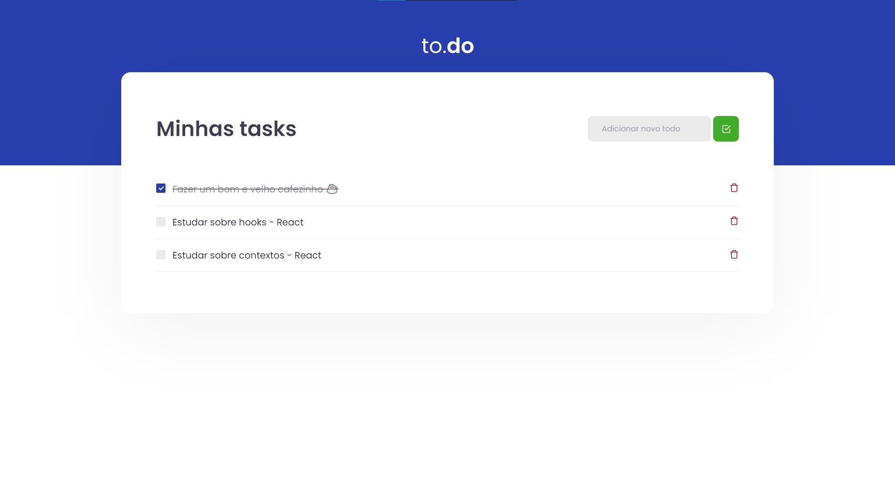

<div align="center">
  <h1>
    ⚔ Desafios — Ignite 🔥
    <br/><br/>
    Conceitos do React
  </h1>

  > Repositório com o código de resolução do desafio **Conceitos do React** da trilha de React JS do bootcamp Ignite da Rocketseat.
</div>

<div align="center">
  

  > <small>Lista de tarefas</small>
</div>

## 🎉 Começando

Clone o repositório:

```bash
git clone https://github.com/MattZ6/reactjs-concepts-challenge
```

Adrente a pasta do projeto:

```bash
cd reactjs-concepts-challenge
```

Instale as dependências:

```bash
yarn
```

## 🔥 Executando

Para executar a aplicação em ambiente de desenvolvimento (localmente):

```bash
yarn dev
```

## 🧪 Testes

Para executar os testes:

```bash
yarn test
```

___

<div align="center">
  <strong>Ignite Bootcamp 🔥</strong>
</div>